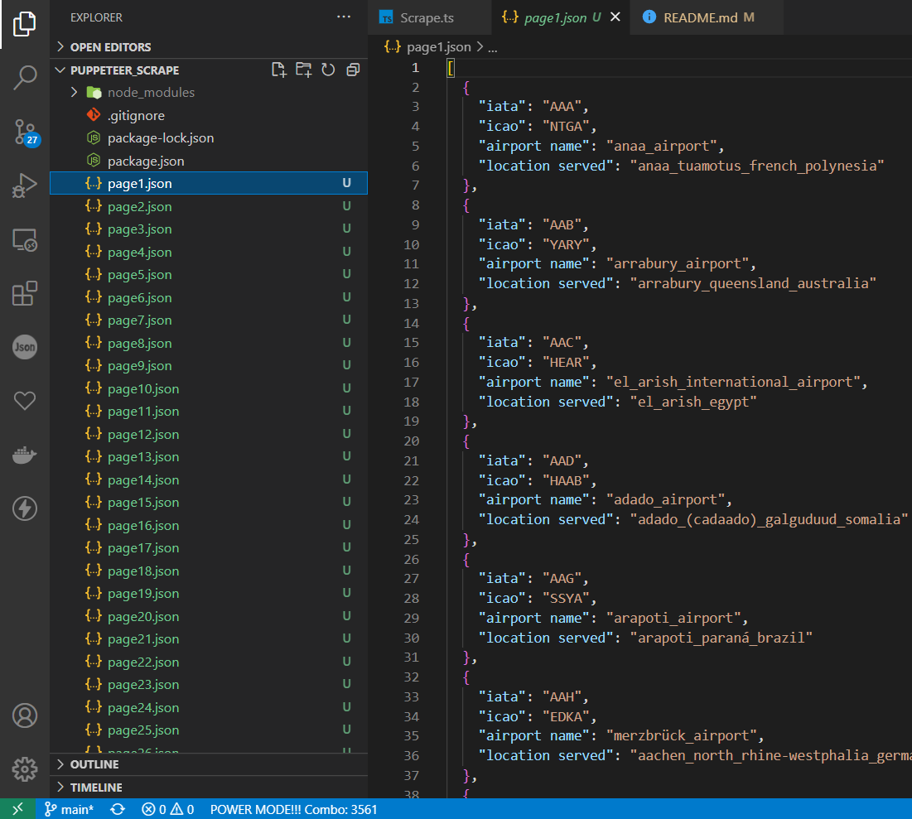

# WIKIPEDIA SCRAPER FOR AIRPORTS
(PS: I am good a Javascript more...if I am selected will master typescript too)

INSTALLATION: <br />
```console
shailesh@puppeteer_scrape:~$ npm install
or
shailesh@puppeteer_scrape:~$ npm i puppeteer
```

RUNNING SCRIPT : <br />
```console
shailesh@puppeteer_scrape:~$ node Scrape.ts
```
CONSOLE OUTPUT : <br />
```console
shailesh@puppeteer_scrape:~$ node Scrape.ts
Saved Succesfully airport names for alphabet A
Saved Succesfully airport names for alphabet B
Saved Succesfully airport names for alphabet C
Saved Succesfully airport names for alphabet D
Saved Succesfully airport names for alphabet E
Saved Succesfully airport names for alphabet F
Saved Succesfully airport names for alphabet G
Saved Succesfully airport names for alphabet H
Saved Succesfully airport names for alphabet I
Saved Succesfully airport names for alphabet J
Saved Succesfully airport names for alphabet K
Saved Succesfully airport names for alphabet L
Saved Succesfully airport names for alphabet M
Saved Succesfully airport names for alphabet N
Saved Succesfully airport names for alphabet O
Saved Succesfully airport names for alphabet P
Saved Succesfully airport names for alphabet Q
Saved Succesfully airport names for alphabet R
Saved Succesfully airport names for alphabet S
Saved Succesfully airport names for alphabet T
Saved Succesfully airport names for alphabet U
Saved Succesfully airport names for alphabet V
Saved Succesfully airport names for alphabet W
Saved Succesfully airport names for alphabet X
Saved Succesfully airport names for alphabet Y
Saved Succesfully airport names for alphabet Z
```



